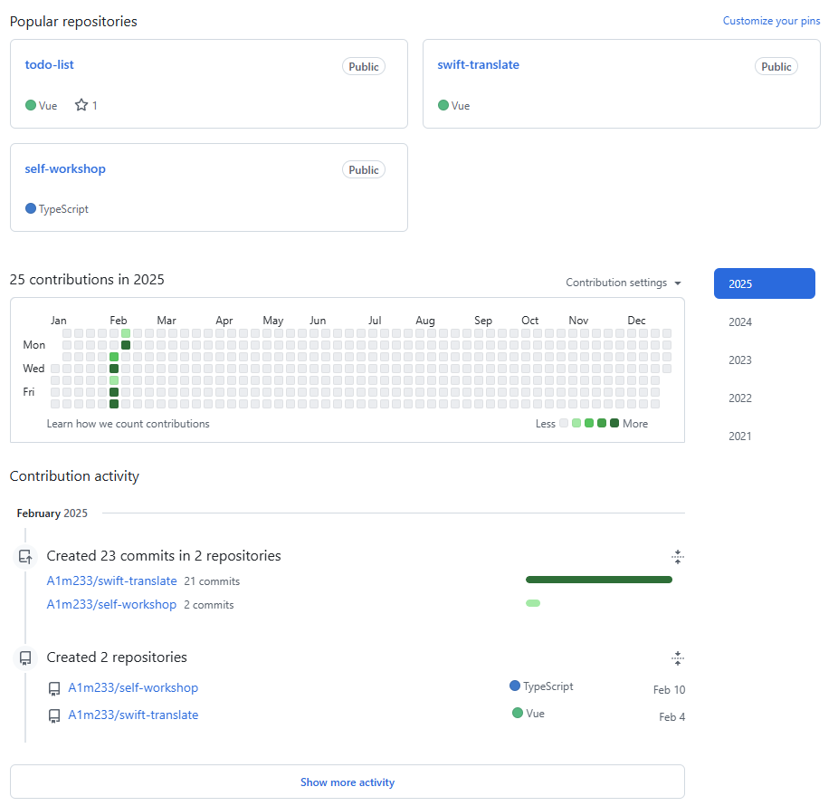

# 设计思路

## 功能

这可能会是一个在之后会增加新模块的项目。目前的想法是个人博客模块和待办事项模块。

### 个人博客模块

能读取本地的MD文件，在网页上进行展示并进行编辑，最后应该保存到同样的位置，也可以选择另存到别的地方。

也可以直接创建MD文件。

需要有一个虚拟的目录结构，类似于文件夹，每一个文件还会有自己在本地存储中的实际地址。

这样的话，随之而来的就是对于文件以及文件夹的移动、删除、查询功能。

该项目并不会支持对于本地文件的移动，它更像一个管理系统，便于没有存放在一起、却有相同分类的文件可以在同一个文件夹中。

那么如果本地文件产生了移动，自然可能会出现之前链接绑定失效的情况，这里就需要有一个没找到文件的页面，去重新进行绑定。

#### 可选

- 让文件夹和文件的移动成为可拖动的。

- 类似于github的活动图

  

### 待办事项模块

这个则是会有一个待办事项的列表，其中存放着多个待办事项。

需要注意的是，待办事项会有时限，则它们会有已过期、即将过期、未完成、完成的状态。这个项目会存在一个首页，其中会显示有哪些待办事项即将过期，有哪些待办事项未完成。同时，这个项目会存在有顶部导航栏，也会显示有多少即将过期、多少未完成。

当然，会有一个统计页，其中会有一些相关的详细信息。

还有总的待办事项展示页面以及不同状态的待办事项列表展示页面。

#### 可选

- 在新产生即将到期的待办事项时，产生一个弹窗，其中有此待办事项以及其它即将到期的待办事项。（完成）

### 在线运行代码模块（可选）

可以通过切换语言以执行不同的代码。

### 杂项模块（可选）

- 更换背景，可以用图片作为背景，进行设置，如透明度。

### AI模块（可选）

引入对话式的AI

## 页面

首先，每个页面都会存在一个header，在下面不再重复。

这个header应该有一个项目名，点击后进行跳转到首页。还要有对于不同模块的页面的导航。以及对于due和expired待办事项

### 首页 /

**上下布局**

header

轮播图

分成待办事项和个人博客

待办事项处要显示有多少个即将到期的todo和多少个未完成的todo。

两者都需要一些标语。

### 待办事项统计页面 /todo/statistics

**上下布局**

在这里展示出总、已完成、未完成、即将到期、已过期的todo数量，并且可以通过点击去进入到对应展示页面。

### 总待办事项展示页面 /todo/list/all

### 已完成待办事项展示页面 /todo/list/finished

### 未完成待办事项展示页面 /todo/list/unfinished

### 即将到期待办事项展示页面 /todo/list/due

### 已过期待办事项展示页面 /todo/list/expired

**上下布局**

实际上它们都是使用了同一个复用的组件，列表组件。

这个组件中应该包含一个卡片：

header：标题+搜索框

content：对应的待办事项列表

footer：pagination

### 博客目录页面 /blog/directory

**上下布局**

在此处展示虚拟的目录结构，可以通过点击进行展开和折叠。

也可以通过搜索找到指定的文件和文件夹。

同时，这个组件应该被复用到博客的详情页中。

需要包含对于目录结构的操作。

### 博客详情页面 /blog/detail/:name

**上左下布局**

这里应该是left + content的结构。

左侧会是一个可伸缩的导航栏，用于展示虚拟目录结构。

右侧是博客的详情。

在content的上部，可以通过一个切换的按钮切换博客是编辑还是查看模式。

#### 编辑模式

...

#### 查看模式

...

还需要有一个组件来表示没有找到对应的文件。

## redux

### features/todolist/todolistSlice

#### 数据

`Todo[]`

```ts
interface Todo
{
	state: boolean,
    content: string,
    expiration: number, // 时间戳？
};
```

#### 功能

编辑到期时间，编辑内容，切换完成状态，添加待办事项，删除待办事项。