# self-workshop

这个项目已经完成了初步的开发。

这个项目会集成多个模块，便利于使用者（主要是软件开发者）工作和学习使用。

目前已经实现的模块有待办事项列表、个人博客。

之后希望可以添加在线代码Playground、大模型对话。

## 已经实现的模块

#### 杂项

使用 [redux-persist](https://github.com/rt2zz/redux-persist) 和 [redux-state-sync](https://github.com/aohua/redux-state-sync) 实现了数据的持久化以及立即的跨页面更新。

### 待办事项模块

#### 首页提醒以及header提醒

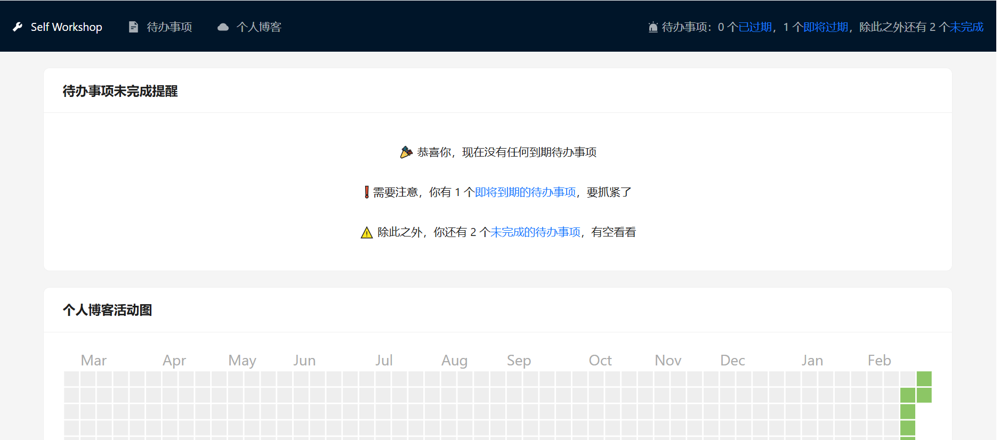

#### 列表页面

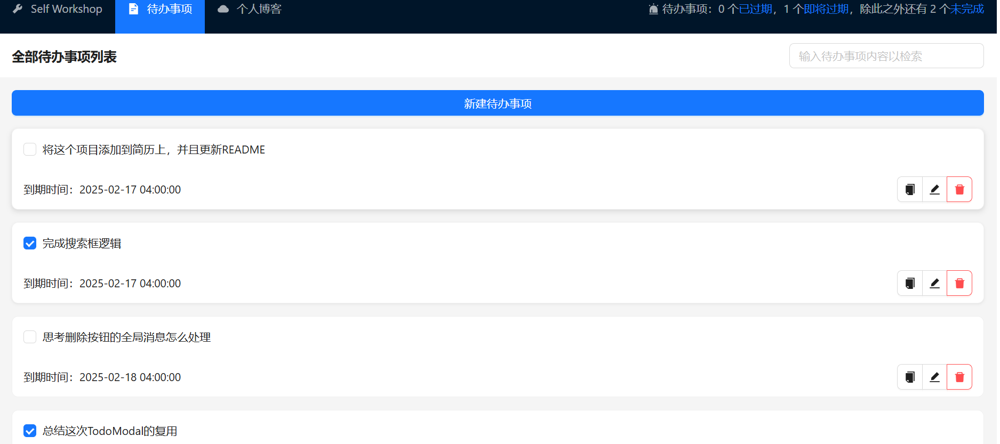

#### 新建待办事项模态窗

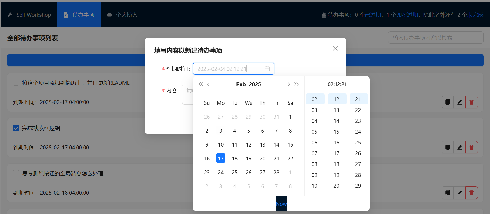

#### 编辑待办事项模态窗

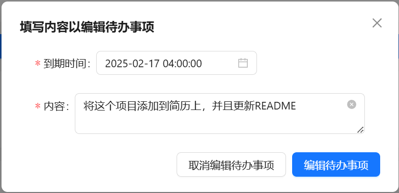

#### 根据待办事项内容检索的搜索框

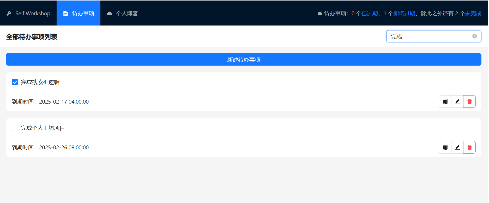

#### 统计数据页面

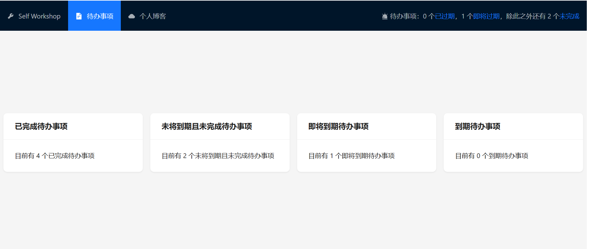

#### 全局弹出即将到期提醒

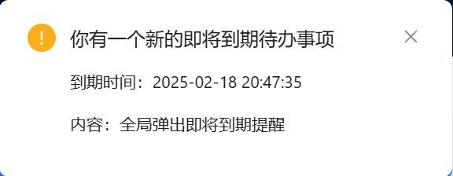

### 个人博客模块

#### 方块颜色根据修改次数在取值范围内变化的[个人博客活动图](https://github.com/kevinsqi/react-calendar-heatmap)

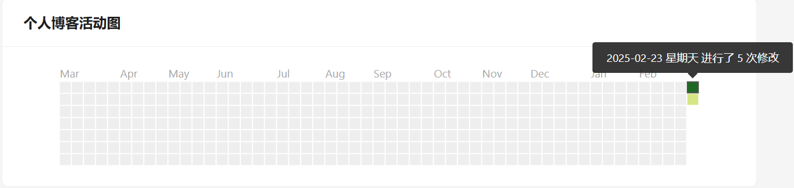

#### 实现了检索和拖拽功能等目录基础功能的目录结构页（同时复用在了可展开的侧边栏中）

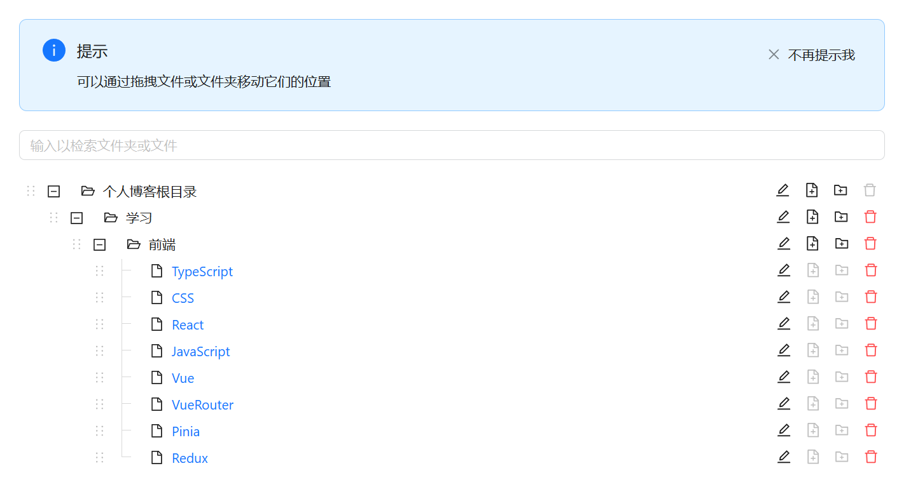

#### 包含[可切换预览模式与编辑模式的Markdown编辑器](https://github.com/imzbf/md-editor-rt)的个人博客详情页

##### 预览模式

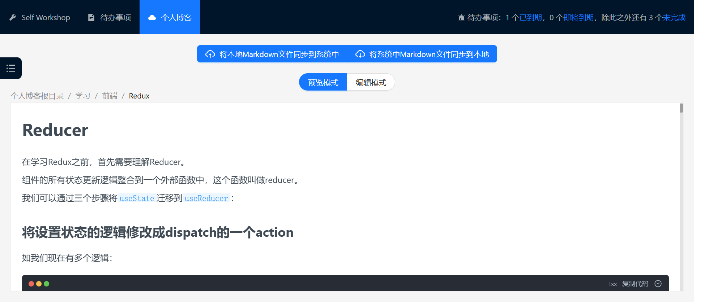

##### 编辑模式

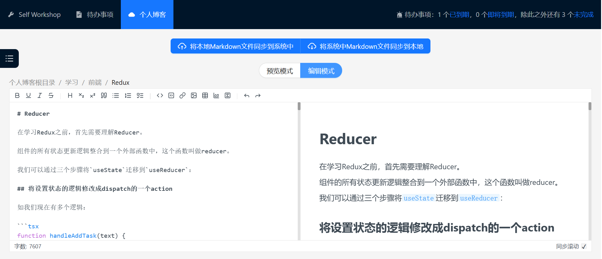
